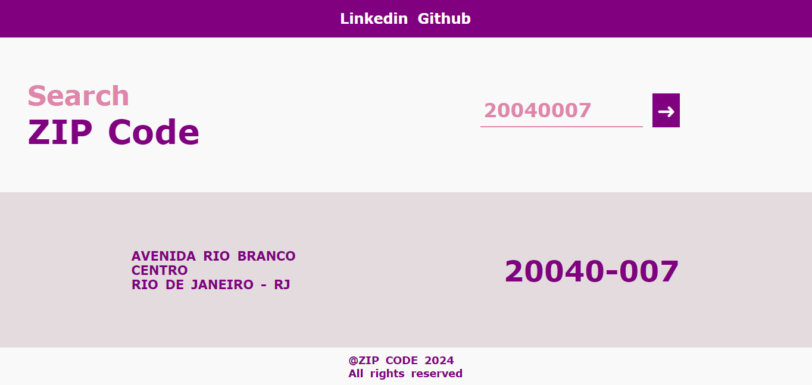
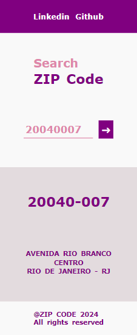

# **ZIP Code Search**

## Sobre o projeto

Clique e acesse o projeto: [zip-code-search-react](https://)

Trabalho realizado com o framework React Js, com uso de TypeScript, HTML5, CSS3, Flexbox e API ViaCEP. 

O aplicativo consiste em fazer uma busca por CEP e exibir qual é a localidade. O aplicativo foi desenvolvido com o uso da API ViaCEP e uso de Axios para fazer a requisição ao servidor. Com layout responsivo para exibição em diferentes dispositivos e com estilo interessante.
 
O objetivo é demonstrar o uso de API Rest com React e TypeScript.

Trabalhei com componentes de cabeçalho, de rodapé e de conteúdo; dividindo as responsabilidades.

 

Work carried out with the React Js framework, using TypeScript, HTML5, CSS3, Flexbox and ViaCEP API.

The application consists of searching by zip code and displaying the location. The application was developed using the ViaCEP API and using Axios to make the request to the server. With a responsive layout for display on different devices and an interesting style.
 
The objective is to demonstrate the use of Rest API with React and TypeScript.

I worked with header, footer and content components; dividing responsibilities.

## Layout Mobile

## Tecnologias Utilizadas

* HTML5
* CSS3
* Flexbox
* Axios
* [API ViaCEP](https://viacep.com.br/)
* Typescript
* React Js

## Instalação

##### Instalar Dependências
<pre><code>npm install</code></pre>

##### Executar Aplicação
<pre><code>npm run dev</code></pre>

## Autor

#### **Katarine Albuquerque**

    
    &nbsp;
    

